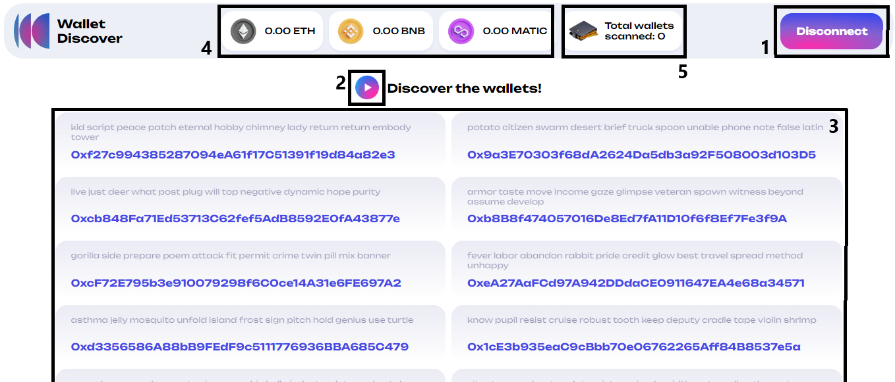
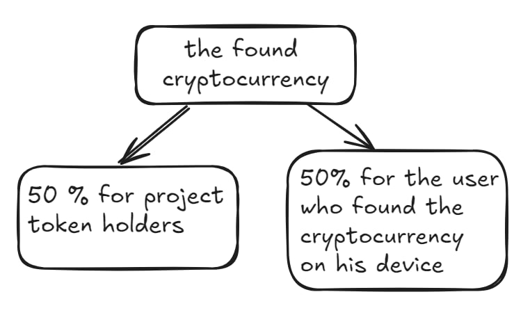

# Wallet Discover Whitepaper

## Introduction

Welcome to Wallet Discover, a revolutionary platform designed to help you search for forgotten wallets while fostering a vibrant community. What sets us apart is our commitment to inclusivity—participation is simple and requires no financial contributions or funds to be locked. Just connect your wallet to our platform and embark on your journey to forgotten assets!

We harness your computing power on a voluntary basis and implement a fair remuneration distribution system.

Simply connect your wallet to the platform and become part of a groundbreaking community that has yet to be seen on the Internet.

## Mission and Vision

Discovering forgotten wallets can be a challenging endeavor. The likelihood of success is significantly lower when you search alone. That's why our project brings together a vast community of participants, enhancing everyone's earning potential while boosting the overall chances of finding hidden treasures.

When a user utilizes our platform, they contribute their device's computing power to the community. The platform generates addresses from random seed phrases to check their balances across the Ethereum, Binance Smart Chain, and Polygon networks. 

If the search yields positive results, the discovered cryptocurrency is distributed between the finder and the holders of the project token. By purchasing a project token, you are guaranteed to receive a share of the found cryptocurrency, proportional to the amount of tokens you hold relative to the total supply.

## Platform overview

**1** - The button for connecting and disconnecting the wallet
**2** - The button to start searching for lost wallets
**3** - Displaying wallets where balances are checked in the current iteration
**4** - The total amount of cryptocurrency that you have found in the current search cycle
**5** - The number of wallets that were scanned after clicking the start button (2)

### How it works

1. The user comes to the platform, connects the wallet (1) and presses start button (2)
2. The platform randomly selects passwords (3) from crypto wallets and checks the balances of native currency in the Ethereum, BSC and Polygon networks (4).
3. If a user finds a cryptocurrency on some wallet, it is automatically sent to another wallet of the project.
4. The found cryptocurrency is distributed as follows: 50% is received by the one who connected his address to the platform and found this cryptocurrency, the other 50% is distributed among the holders of the project token.

## Tokenomics

| **Use** | **%** |
|---------|-------|
| one     | x     |
| two     | x     |
| three   | x     |